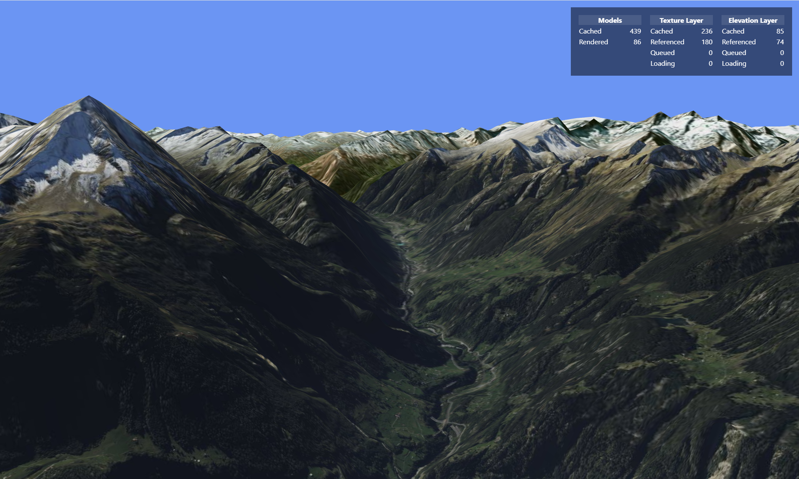
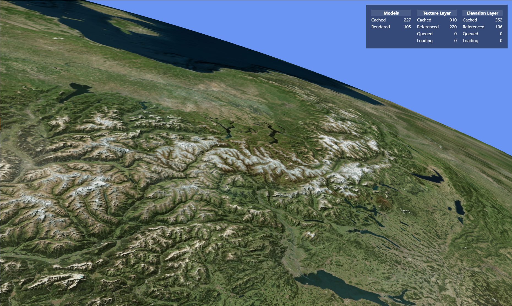

# What is this

This is a WIP project still, but aims at becoming something like a digital globe React component. It overlays a texture layer of your choice with elevation, a bit like Google Earth does.

# Where to fetch elevation data
I'm using ASTER data here, and you can download that over at [https://search.earthdata.nasa.gov](https://search.earthdata.nasa.gov):

 - Select a region with the spatial selection tool
 - In the "Instruments" section, select ASTER
 - Download the map tiles into a folder on your machine.

# How to configure

You need to run both the C# elevation server in the `dotnet/ElevationApi` folder as well as the vite development server (`web/webmap`).

## Running the elevation server

Set the following environment variables:

 - `DEM_DATA`: This should point to the folder where you've downloaded the ASTER tiles to
 - `CACHE_FOLDER`: To speed things up, tiles can be cached. Especially generating lower zoom levels takes quite some time, so you want to cache those. Provide a path to a blank folder and this will happen.

 You can (and probably should) call the `prefillCache` method to pre-populate the cache folder. Please do so at least for zoom level 6.

 ## Running the vite dev server

 No surprises here, just navigate to `web/webmap` and run `yarn dev`.

